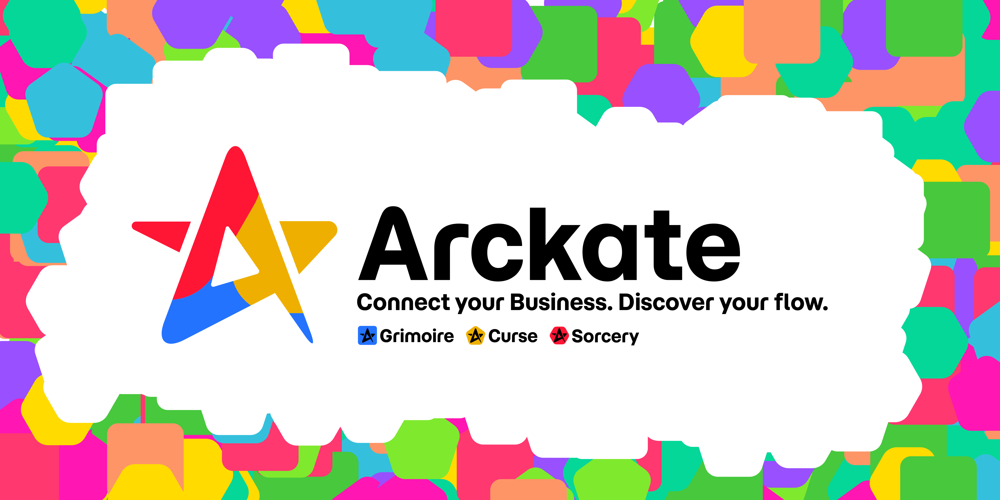

> 🚧 **Coming Soon**  
> This repository is a preview of **Arckate**, a new approach to enterprise communication through metadata.  
> The first public release is on its way — contributions and feedback are welcome in the meantime!

# Arckate

**Connect your Business. Discover your flow.**

In many organizations, communication is broken.  
Documentation is scattered, static, and often makes things worse.  
Teams speak different languages — design, dev, HR, ops — and the glue is missing.

**Arckate** is a new approach.

It’s a modular system that turns metadata into a shared language across your enterprise.  
Not through more docs — but through living, versioned, visualized flows.

---

## What is Arckate?

Arckate is a Git-native ecosystem of tools that help you:

- **Generate** metadata from code and tools
- **Sync** it across systems
- **Visualize** it to reconnect teams

It’s composed of three open-source projects:

---

###      [Grimoire](https://github.com/Arckate/grimoire)

> A CLI framework to build better developer tools.

Grimoire helps you scaffold and test CLI tools with great DX.  
It can also generate `.gen.{json,yaml,md...}` metadata from codebases.

---

###  [Curse](https://github.com/Arckate/curse)

> A plugin-powered CLI to sync your tools with Git.

Curse connects tools like Figma, Jira, Workday, and Penpot — extracting and injecting metadata via `.gen.{json,yaml,md...}` files.

---

###  [Sorcery](https://github.com/Arckate/sorcery)

> A visual interface to explore and enrich your metadata.

Sorcery lets you visualize `.gen.{json,yaml,md...}` files from multiple repos, stream live logs, and edit metadata with context — from architecture to org charts.

---

## Why Arckate?

Because your business is more than documents.  
It’s flows, systems, people, and decisions — and they deserve a better way to connect.

> Arckate helps you reopen the conversation.  
> Not with static docs, but with dynamic, shared metadata.
